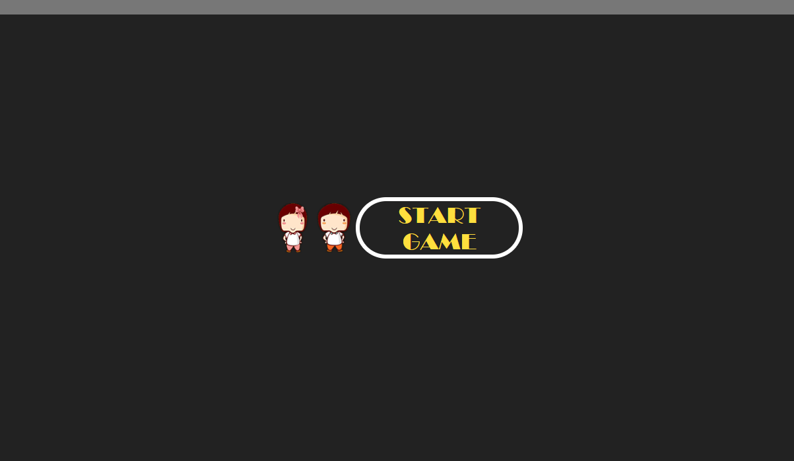
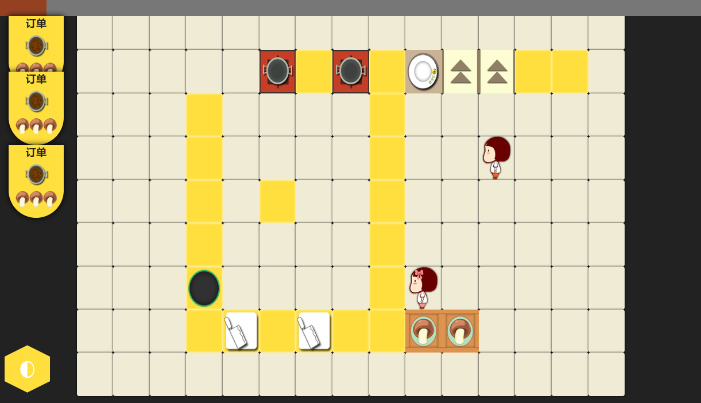

# myovercooked

## 游戏玩法

点击`start game` 开始游戏，玩家使用移动键移动，玩家移动至箱子旁边，使用操作键，从箱子中取放原料，然后放置原料于菜板上，使用操作键拿取切好的材料，可以放到锅中进行烹饪，烹饪结束后放到盘子上，最终菜品放到上菜口，游戏结束。

玩家1：移动键 A/S/D/W 操作键 Q键

玩家2：移动键 ←/↓/→/↑ 操作键 /键

## 游戏截图

## Todo
- [ ] 烹饪，切菜添加定时器。
- [ ] 完善菜谱功能
